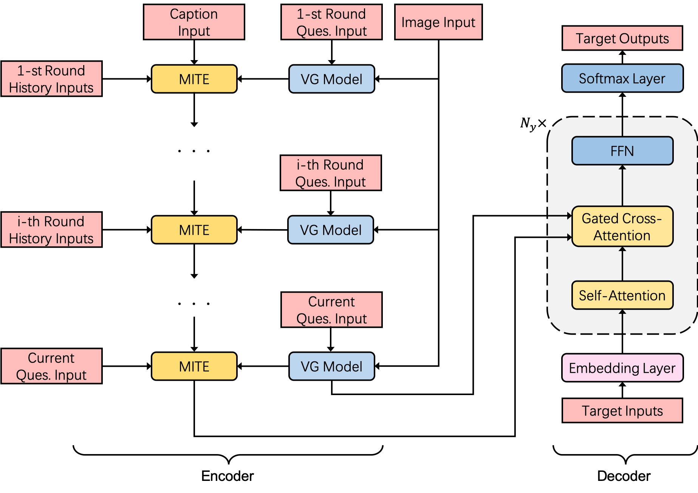

# MITVG
This is a PyTorch implementation for Multimodal Incremental Transformer with Visual Grounding for Visual Dialogue.
<!---->


Setup and Dependencies
----------------------

This starter code is implemented using PyTorch v1.0, and provides out of the box support with CUDA 9 and CuDNN 7.
There are two recommended ways to set up this codebase: Anaconda or Miniconda, and Docker.

### Anaconda or Miniconda

1. Install Anaconda or Miniconda distribution based on Python3.6.
2. Clone this repository and create an environment:

```sh
git clone https://github.com/paper-coder/MITVG
conda create -n visdialch python=3.6

# activate the environment and install all dependencies
conda activate visdialch
cd visdial-challenge-starter-pytorch/
pip install -r requirements.txt

# install this codebase as a package in development version
python setup.py develop
```

Data Preparing
-------------

1. Download the VisDial v1.0 dialog json files from [here][1] and keep it under `$PROJECT_ROOT/data` directory, for default arguments to work effectively.

2. Get the word counts for VisDial v1.0 train split [here][2]. They are used to build the vocabulary.

3. We extracte image features of VisDial v1.0 images, using a Faster-RCNN pre-trained on Visual Genome,, introduction and code from [here][3].

4. We use NeuralCore for reference resolution, introduction and code from [here][4]

5. We use Visual Grounding Model to obatin our visual grounding features, introduction and code from [here][5]


Training
--------

Train the baseline model provided in this repository as:

```sh
python train.py --config-yml configs/mit_gcad_faster_rcnn_x101.yml --gpu-ids 0 1 # provide more ids for multi-GPU execution other args...
```

To extend this starter code, add your own encoder/decoder modules into their respective directories and include their names as choices in your config file. We have an `--overfit` flag, which can be useful for rapid debugging. It takes a batch of 5 examples and overfits the model on them.

### Saving model checkpoints

This script will save model checkpoints at every epoch as per path specified by `--save-dirpath`. 

### Logging

We use [Tensorboard][5] for logging training progress. Recommended: execute `tensorboard --logdir /path/to/save_dir --port 8008` and visit `localhost:8008` in the browser.


Evaluation
----------

Evaluation of a trained model checkpoint can be done as follows:

```sh
python evaluate.py --config-yml /path/to/config.yml --load-pthpath /path/to/checkpoint.pth --split val --gpu-ids 0
```

This will generate an EvalAI submission file, and report metrics from the [Visual Dialog paper][6] (Mean reciprocal rank, R@{1, 5, 10}, Mean rank), and Normalized Discounted Cumulative Gain (NDCG), introduced in the first Visual Dialog Challenge (in 2018).

The metrics reported here would be the same as those reported through EvalAI by making a submission in `val` phase. To generate a submission file for `test-std` or `test-challenge` phase, replace `--split val` with `--split test`.


Results and pretrained checkpoints
----------------------------------

Performance on `v1.0 val` (trained on `v1.0` train):

  Model  |  R@1   |  R@5   |  R@10  | MeanR  |  MRR   |  NDCG  |
 ------- | ------ | ------ | ------ | ------ | ------ | ------ |
[MITVG][12] | 0.4617 | 0.7780 | 0.8730 |  4.7545| 0.6041 | 0.5162 |


Acknowledgements
----------------

* This code began as a fork of [batra-mlp-lab/visdial-challenge-starter-pytorch][7] and [attention is all you need][8]. We thank the developers for doing most of the heavy-lifting.

[1]: https://visualdialog.org/data
[2]: https://s3.amazonaws.com/visual-dialog/data/v1.0/2019/visdial_1.0_word_counts_train.json
[3]: https://github.com/peteanderson80/bottom-up-attention
[4]: https://github.com/huggingface/neuralcoref
[5]: https://github.com/zyang-ur/onestage_grounding
[6]: https://arxiv.org/abs/1611.08669
[7]: https://github.com/batra-mlp-lab/visdial-challenge-starter-pytorch
[8]: https://github.com/jadore801120/attention-is-all-you-need-pytorch


